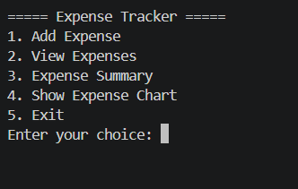
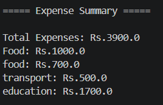
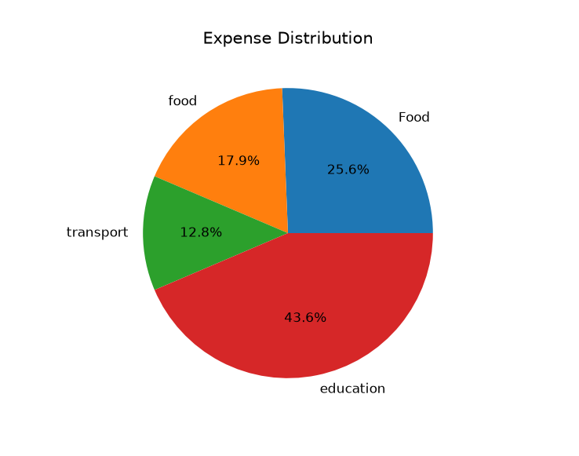

# Expense Tracker

A Python-based Expense Tracker application that helps users record, manage, and analyze their daily expenses.

## Features

* Add expenses with amount, category, and description
* View all recorded expenses
* Save data permanently using JSON
* Generate expense summaries
* Visualize spending using pie charts
* Input validation for safer data entry

## Technologies Used

* Python
* JSON
* Matplotlib
* Git & GitHub

## Installation

Clone the repository:

```bash
git clone https://github.com/Avish-Tharu/expense-tracker.git
cd expense-tracker
```

Install required package:

```bash
python -m pip install matplotlib
```

Run the application:

```bash
python expense_tracker.py
```

## Screenshots

### Main Menu



### Expense Summary



### Expense Chart



## Project Status

Completed as a beginner Python portfolio project demonstrating file handling, data persistence, data visualization, and Git version control.

